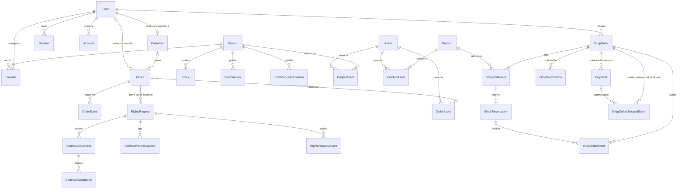

# Modèle de données — V1.1

> Phase 4 ajoute `legal_document_versions` et `consumer_withdrawal_requests` de façon additive. Les documents candidats ne sont pas activés. Une déclaration conserve horodatage, référence, parent vérifié éventuel, revue d’éligibilité et empreinte d’accusé, sans mutation automatique du paiement.

## Périmètre

La V0.4 crée la fondation PostgreSQL avec Prisma ORM. La V0.6.0.3 migre les 25 projets de façon contrôlée et choisit PostgreSQL comme source runtime unique du site public. V0.7 ajoute les paiements test, la livraison privée et les droits post-livraison versionnés. V1.1 ajoute, sans modifier ces flux, le catalogue produit et le ledger Boutique séparé.

Le schéma prépare le catalogue administrable, les comptes, les clients, les commandes personnalisées, les fichiers et la traçabilité. La V0.6 active les brouillons, commandes et photos de référence privées. La V0.6.0.1 ajoute les demandes de droits post-livraison, sans back-office complet, paiement, facture, contrat électronique ni livraison audio.

## Vue d’ensemble



Les crédits peuvent appartenir soit à un projet, soit à une piste. Cette exclusivité est garantie par une contrainte SQL dans la migration initiale.

## Identifiants et dates

- les entités principales utilisent des UUID v4 générés par Prisma et stockés dans des colonnes PostgreSQL `UUID` ;
- les tables de jointure simples utilisent une clé primaire composite fondée sur leurs relations ;
- `createdAt` et `updatedAt` sont des `TIMESTAMPTZ(3)` ;
- `releaseDate` est un vrai type `DATE` nullable ;
- aucune date inconnue n’est remplacée par une valeur conventionnelle.

## User et rôles

`User` représente un compte et son niveau d’accès, pas automatiquement un client.

Rôles conservés :

- `ADMIN` : futur accès d’administration ;
- `MEMBER` : membre authentifié sans obligation d’achat ;
- `CUSTOMER` : compte orienté espace client.

`EDITOR` n’est pas ajouté : aucune permission actuelle ne justifie ce rôle. Une table de rôles multiples pourra remplacer l’enum si les besoins réels le demandent plus tard.

Les états `PENDING`, `ACTIVE`, `SUSPENDED` et `DEACTIVATED` pilotent l’ouverture de session : seul `ACTIVE` est accepté. Une inscription publique impose `MEMBER/PENDING`, puis une vérification valide synchronise `emailVerified`, `emailVerifiedAt` et le passage conditionnel à `ACTIVE`. `Account` stocke le hash Argon2id du credential, jamais un mot de passe en clair. `Session` conserve le token opaque côté serveur et son expiration. `Verification` stocke des identifiants de reset hachés et les empreintes uniques des vérifications consommées. `RateLimit` partage les compteurs entre instances. Aucun administrateur réel n’est créé.

## Customer et distinction avec User

`Customer` est une identité métier optionnellement liée à un `User` par une relation un-à-un :

- un membre peut ne jamais devenir client ;
- un client peut exister avant la création d’un compte ;
- la suppression d’un compte met la relation à `NULL` sans détruire le dossier client ;
- une commande conserve un instantané `customerEmail` et `customerName`, afin que son historique ne change pas avec le profil courant.

Cette duplication limitée est volontaire : `User.email` sert au compte, `Customer.email` au contact métier courant et `Order.customerEmail` à la preuve historique. La future couche serveur devra normaliser les adresses avant écriture et définir les règles de synchronisation explicites.

## Catalogue

`Project` couvre les albums, singles et projets, avec les états `DRAFT`, `IN_DEVELOPMENT`, `PUBLISHED` et `ARCHIVED`. La date, les descriptions et le nombre de pistes restent nullables. `catalogPosition` stabilise l’ordre, `highlighted` conserve la sélection éditoriale et `featured` désigne l’unique mise en avant de l’accueil. `artworkTone`, les champs SEO et `legacySourceVersion` complètent la migration sans inventer de donnée.

Depuis la V0.6.1, le statut éditorial est distinct de l’exposition publique : `publicVisible` masque un projet de la discographie, de sa route directe, du sitemap et de ses médias publics sans falsifier son avancement. `jukeboxPlacement` choisit explicitement le jukebox `PUBLISHED`, `DEVELOPMENT` ou aucun ; `jukeboxPosition` fournit un ordre nullable. Les positions absentes, dupliquées ou espacées restent déterministes grâce au repli sur `catalogPosition`, puis le slug. La migration additive initialise uniquement les projets déjà publics et dotés d’une cover selon leur statut existant ; elle ne cache, ne publie et ne requalifie arbitrairement aucune œuvre.

La suppression logique par `ARCHIVED` est privilégiée. Les relations structurantes utilisent `RESTRICT` pour empêcher qu’un projet soit supprimé avec ses pistes, crédits, liens, annotations ou associations d’assets.

### Track

Une piste appartient à un projet. La paire `(projectId, position)` est unique et la migration impose une position strictement positive. La durée en secondes est nullable et ne peut pas être négative.

### PlatformLink

Les profils artiste ne sont pas dupliqués sur chaque projet :

- `ARTIST` impose `projectId = NULL` ;
- `RELEASE` impose un projet ;
- `STORE` accepte une portée globale ou liée à un projet.

L’URL est unique. Une contrainte SQL maintient la cohérence entre portée et relation.

### Credit

Un crédit appartient exactement à un projet ou à une piste. Le rôle, le nom, une note optionnelle, l’ordre d’affichage et la confiance sont stockés. Aucun crédit fictif n’est créé.

### Confiance des données

L’enum `DataConfidence` conserve `CONFIRMED`, `PARTIAL`, `PLACEHOLDER` et `UNKNOWN` sur les principales entités éditoriales.

`ConfidenceAnnotation` précise, pour chaque domaine d’un projet, le niveau, une source optionnelle, une note, une date de validation et un futur relecteur. La paire `(projectId, domain)` est unique : elle représente l’état courant exploitable par une future administration sans inventer un historique qui n’existe pas encore.

## Assets

`Asset` stocke uniquement des métadonnées : clé de stockage, backend (`LOCAL` ou `OBJECT`), fournisseur, visibilité, SHA-256, nom, MIME, poids, dimensions, durée optionnelle, texte alternatif, droits et confiance. Aucun binaire n’est placé dans PostgreSQL.

Les relations `ProjectAsset` et `OrderAsset` décrivent l’usage réel d’un fichier : pochette, Hero, galerie, référence client, document ou livraison. Les suppressions sont en `RESTRICT` pour empêcher la disparition silencieuse d’un fichier encore référencé.

La V0.6 utilise `Asset` et `OrderAsset` pour les photos de référence client (`REFERENCE`, `IMAGE`, `PRIVATE`). Commander n’accepte aucun audio client. V0.7.1 active le flux inverse Admin LNX → Client : un master MP3/WAV utilise `Asset.type = AUDIO`, `OrderAsset.role = DELIVERY` et `visibility = PRIVATE`. Le binaire reste sous une clé R2 opaque hors `public/` ; la base conserve uniquement les métadonnées vérifiées. Un index unique partiel impose un seul master actif par Order et le remplacement produit une trace métier interne.

`OrderNotification` constitue une outbox persistante liée à l’Order par une FK `RESTRICT`. Sa clé d’idempotence unique distingue la notification propriétaire après paiement et la notification client après livraison. Les états `PENDING`, `PROCESSING`, `SENT` et `FAILED`, le compteur d’essais et un code d’erreur borné permettent le retry sans stocker de payload fournisseur. Les canaux `EMAIL` et `SMS` sont modélisés ; SMS n’a encore aucun provider.

La V0.6.0.4 ajoute `AUDIO_PREVIEW` aux types et rôles catalogue. Un projet possède au plus un extrait actif par service transactionnel et verrou consultatif. Sa durée générée, 60 secondes maximum, vit dans `Asset.durationMs` et reste totalement indépendante de `Track.durationSeconds`, réservé au morceau complet. Le MP3/WAV source complet est temporaire et n’entre jamais dans le modèle. Un remplacement crée un nouvel `Asset`, échange la relation puis supprime l’ancien fichier ; le client compare exclusivement `expectedAudioAssetId`, avant et après FFmpeg, afin qu’une édition étrangère au média ne provoque pas de conflit.

## Commandes

`Order` porte le parcours de création personnalisée avec :

- un numéro unique ;
- un compte et un client optionnels ;
- un contact historique obligatoire ;
- un brief borné, ses repères narratifs et sa direction musicale ;
- un usage historique compatible avec `PERSONAL` ou `COMMERCIAL_EXTENDED`, mais forcé à `PERSONAL` par le flux initial actif ;
- un snapshot du prix en centimes (`base`, `cover`, `priority`, `total`, devise et version) ;
- le retour inclus et consommé, ainsi que les jalons de soumission, service, livraison, expiration et annulation ;
- les états détaillés du brouillon jusqu’à la livraison, au refus, à l’annulation ou au remboursement futur.

Une séquence PostgreSQL indépendante produit les numéros `LNX-AAAA-NNNNNN` sans collision concurrente. Les contrôles SQL imposent prix non négatifs, somme du snapshot, cohérence usage/contrat, bornes de révision et expiration postérieure à la livraison. Les détails d’autorisation et de workflow sont dans [`docs/ORDER_MODEL.md`](ORDER_MODEL.md).

### Droits et contrats post-livraison

`RightsRequest` représente une licence de publication à 150 € ou une étude de partenariat à 1 500 €, sans modifier le snapshot de l’Order. Les prix et la devise sont calculés côté serveur. Les coordonnées, contributions, matrice de droits, proposition commerciale, messages et audit sont structurés. `ContractTemplate` est versionné et soumis au Legal Review Gate. `ContractDocument` référence un Asset PDF R2 PRIVATE, son hash et son snapshot immuable ; `ContractAcceptance` relie consentement, utilisateur, document, version et preuve de session. L’ancien `CommercialLicense` est conservé uniquement comme archive de migration et n’est plus une source de vérité runtime.

### Historique

`OrderEvent` conserve les transitions de statut, une note, un acteur optionnel, une visibilité `CLIENT` ou `INTERNAL` et leur date. La timeline membre ne sélectionne que `CLIENT`. La migration refuse un événement dont les états source et destination sont identiques. Le service supprime seulement un brouillon appartenant au membre et ses données associées.

### Paiements

`Payment` prouve le paiement initial de l’Order. Aucun Payment n’est créé pour une `RightsRequest` dans V0.7.2 ; `READY_FOR_PAYMENT` est un état préparatoire sans bouton ni appel Stripe. Le paiement des droits, sa facture et ses règles de remboursement exigent un sprint ultérieur après revue juridique. Aucune donnée bancaire sensible n’est stockée dans les modèles contractuels.

## Favoris

`Favorite` est une jointure simple entre `User` et `Project`, avec une clé primaire composite empêchant les doublons. Sa suppression suit celle du compte ou du projet, car il ne constitue pas un historique métier ou légal.

## Suppressions et conservation

- compte : future désactivation/anonymisation avant suppression ; références métier mises à `NULL` ; favoris supprimés ;
- client : les commandes gardent leur instantané de contact et la relation peut être mise à `NULL` ;
- projet : archivage privilégié, suppressions structurantes restreintes ;
- commande : suppression restreinte si un événement, un asset ou une extension de droits existe ;
- asset : suppression restreinte tant qu’il est référencé ;
- acteur d’un événement ou relecteur : relation mise à `NULL`, trace conservée.

Les règles de conservation légale devront être validées avant l’activation des commandes.

## Confidentialité et RGPD

L’architecture applique la minimisation : seuls les champs utiles au compte ou à la relation client sont prévus. La future application devra permettre :

- export des données d’un compte ;
- rectification et suppression/anonymisation selon la base légale ;
- conservation séparée des commandes soumises aux obligations applicables ;
- consentement marketing explicite, daté et révocable dans une table dédiée si la newsletter est activée ;
- journalisation limitée, sans brief, token ou URL de connexion dans les logs.

Aucune préférence marketing n’est modélisée avant l’existence d’un besoin et d’un parcours de consentement réel.

## Prisma et connexions

Prisma Client est généré dans `generated/prisma`, répertoire ignoré par Git et recréé par `postinstall`. `lib/prisma.ts` utilise `@prisma/adapter-pg` et un singleton global en développement pour éviter la multiplication des pools pendant le rechargement Next.js.

Les appels runtime échouent avec un message neutre si `DATABASE_URL` manque. Un adaptateur loopback injoignable permet uniquement d’instancier Prisma pendant un build sans secret ; aucune connexion n’est ouverte. Les pages catalogue publiques interrogent PostgreSQL par la couche serveur centralisée et échouent explicitement si la base est indisponible.

## Extensions auth V0.5.1 et V0.5.2

La migration `auth_foundation` ajoute `auth_accounts`, `auth_sessions`, `auth_verifications` et `auth_rate_limits`, ainsi que les champs Better Auth nécessaires sur `users`. Les comptes et sessions sont supprimés en cascade avec `User`; les compteurs et vérifications sont indépendants.

`emailVerified` est l’état technique attendu par l’adaptateur. Depuis la V0.5.2, le workflow de vérification synchronise `emailVerifiedAt` et active uniquement un membre encore `PENDING`. La migration `registration_recovery_token_uniqueness` remplace l’index non unique de `Verification.identifier` par une contrainte unique, nécessaire aux marqueurs de consommation concurrents. Aucune migration précédente n’est réécrite. Les détails de session, cookie, autorisation et tests sont consignés dans [`docs/AUTH.md`](AUTH.md).

## Migration initiale

La migration a été générée par `prisma migrate diff` depuis un état vide, sans connexion à une base. Elle ajoute quelques contraintes `CHECK` PostgreSQL non exprimables directement dans Prisma : valeurs positives, parent unique des crédits et cohérence des portées de plateformes.

La réserve d’exécution de la V0.4 est levée par `V0.4.1 — PostgreSQL Runtime Validation`. La migration a été appliquée depuis une base locale vide, réinitialisée avec consentement explicite, puis rejouée sans erreur SQL. `prisma migrate status` confirme que la base est à jour ; les comparaisons migrations → base et schéma Prisma → base ne détectent aucune différence.

## Validation PostgreSQL V0.4.1

La validation a utilisé exclusivement l’instance locale jetable `lnx-studio-v041-test`, fournie par Prisma Dev et isolée sur l’adresse de boucle locale. Le moteur a déclaré PostgreSQL 17.5 sur PGlite. Aucun service distant, identifiant de production, secret de production ou environnement de production n’a été utilisé.

Le schéma physique obtenu contient les 13 tables métier, la table de migrations, 15 enums, 17 clés étrangères, 14 clés primaires, 42 index et les 11 contraintes `CHECK` nommées par la migration. La suite `npm run test:database` valide :

- le singleton et la connexion Prisma, le CRUD, les valeurs par défaut, les UUID et les horodatages ;
- 11 contraintes uniques ou composites, 11 contraintes `CHECK` et une violation de clé étrangère ;
- 3 suppressions `RESTRICT`, 5 mises à `NULL` et 2 cascades ;
- le rollback d’une transaction, une concurrence sur unicité, puis la déconnexion et la reconnexion ;
- le nettoyage complet des données QA avant de rendre la main.

La suite refuse de s’exécuter sans toutes ses gardes : `NODE_ENV=test`, `ALLOW_DATABASE_RESET=true`, cible logique exacte `lnx-studio-v041-test`, base attendue explicite, protocole PostgreSQL, hôte de boucle locale et port non standard différent de 5432. Les valeurs de connexion restent hors Git.

Procédure reproductible sur une nouvelle base locale jetable :

```bash
npx prisma migrate deploy
npx prisma migrate status
NODE_ENV=test \
ALLOW_DATABASE_RESET=true \
LNX_DATABASE_TARGET=lnx-studio-v041-test \
LNX_EXPECTED_DATABASE=<nom-base-locale> \
DATABASE_URL=<url-postgresql-locale-jetable> \
npm run test:database
```

Le reset et la comparaison de drift requièrent une autorisation séparée ainsi qu’une base shadow locale distincte et jetable. `DATABASE_URL` et `SHADOW_DATABASE_URL` ne doivent jamais viser la production. Après la validation V0.4.1, les données QA comptaient zéro ligne et l’instance `lnx-studio-v041-test` a été supprimée.

## Migration du catalogue

La migration V0.6.0.3 est additive, idempotente et gardée par une liste fermée de cibles locales. Elle importe les 25 projets sans seed fictif, conserve les valeurs nulles et refuse d’écraser une ligne déjà différente. La parité compare la représentation publique complète après mapping. La procédure et le plan de retour arrière figurent dans [`docs/CATALOG_RUNTIME_MIGRATION.md`](CATALOG_RUNTIME_MIGRATION.md).

## V1.1 — tarifs, produits et commandes Boutique

La migration V1.1.0 est strictement additive. `MusicPricingVersion` conserve les
grilles immuables, `MusicPricingConfiguration` désigne la version active avec
une révision optimiste et `MusicPricingActivation` journalise chaque activation.
Les snapshots `Order` et `Payment` existants ne sont ni réécrits ni reliés par
une nouvelle clé étrangère.

`Product` représente un article physique ou numérique sans le spécialiser pour
les CD. `ProductAsset` relie son image principale à l'infrastructure `Asset`,
`ProductStockAdjustment` trace les corrections de stock et
`ProductAuditEvent` les mutations sensibles. Les relations et suppressions
restent restrictives afin de conserver l'historique ; l'archivage est préféré.

La Phase 2 ajoute un ledger distinct du modèle musical `Order`/`Payment` :

- `ShopOrder` appartient à un `User`, possède un numéro
  `LNX-SHOP-AAAA-NNNNNN`, une clé UUID de création unique par utilisateur et
  l'empreinte SHA-256 de l'intention normalisée ;
- `ShopOrderItem` fige le titre, le suivi de stock, le prix unitaire, la
  quantité, les montants de ligne et les frais d'envoi unitaires/de ligne ;
- `StockReservation` existe uniquement pour une ligne dont le stock est suivi
  et porte son état ainsi que ses horodatages ;
- `ShopOrderEvent` journalise séparément les événements de commande et ceux de
  réservation, avec acteur optionnel et métadonnées JSON objet.

L'adresse de livraison est snapshotée sur `ShopOrder` seulement si au moins une
ligne exige un envoi. La devise reste `EUR`. Les contraintes SQL imposent
notamment :

```text
lineTotalCents    = unitPriceCents × quantity
lineShippingCents = unitShippingCents × quantity
shippingCents     = somme des lineShippingCents
totalCents        = subtotalCents + shippingCents
```

Le tarif d'envoi est donc **par exemplaire**, et non une seule fois par ligne.
Le service calcule les agrégats ; les contraintes de ligne et de commande
protègent leur cohérence persistée.

Une création normale commence en `OPEN`, `AWAITING_PAYMENT` et `PENDING`, avec
une échéance issue de `SHOP_RESERVATION_TTL_MINUTES`. L'environnement QA utilise
30 minutes, mais exige que la valeur soit fournie explicitement avant
l'activation (plage 5–120). Une réservation commence en `ACTIVE`; elle peut être
`RELEASED` par annulation ou `EXPIRED` par le traitement d'échéance. La Phase 2
ne crée aucun paiement et n'expose aucune transition de paiement ou
d'expédition.

La clé d'idempotence et l'empreinte garantissent qu'une répétition identique
retrouve la même commande tandis qu'une réutilisation pour une intention
différente est refusée. Les verrous advisory PostgreSQL sérialisent la création
par clé et par produit. La disponibilité est calculée à partir de
`Product.stock` moins les réservations `ACTIVE` non échues ; réserver ne
décrémente pas le stock.

Voir [`SHOP_FOUNDATION.md`](SHOP_FOUNDATION.md),
[`SHOP_ORDER.md`](SHOP_ORDER.md), [`SHOP_INVENTORY.md`](SHOP_INVENTORY.md) et
[`PRICING_ADMIN.md`](PRICING_ADMIN.md).

## V1.1 Phase 3A — parent financier et audit Boutique

`Payment.orderId` et `Payment.shopOrderId` sont optionnels individuellement,
mais une contrainte SQL impose exactement un parent. Le même invariant vaut
pour `OrderNotification`. Les lignes historiques musicales conservent leur
`orderId`; aucune réécriture métier ou backfill de provider n'est effectué.
La source `MUSIC_ORDER`/`SHOP_ORDER` se déduit de ce parent exclusif.

Deux index partiels protègent la Boutique : une tentative active par provider
et une seule réussite globale par `ShopOrder`. Le premier succès vérifié est le
winner. Un autre succès authentique est audité pour revue sans confirmer une
seconde fois le stock ou la commande.

`ShopOrder` reçoit le snapshot de version/hash/horodatage des conditions
acceptées, les champs de revue et les horodatages/données de suivi du
fulfillment. `ShopOrderLifecycleEvent` possède une clé d'idempotence unique et
sépare l'audit paiement/CGV/préparation de l'audit réservation Phase 2. La
migration est la 21e et ne supprime ni ne réécrit une ligne existante.
