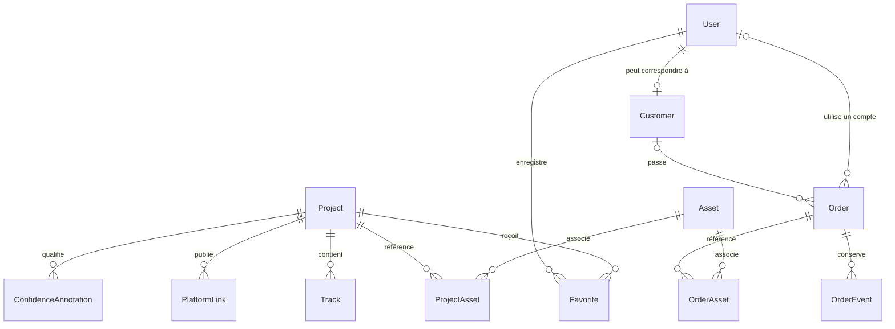

# Modèle de données — V0.4

## Périmètre

La V0.4 crée une fondation PostgreSQL avec Prisma ORM. Elle ne connecte aucune base de production, ne migre aucune donnée artistique et ne change pas la source runtime du site public. `data/discography.ts` reste la seule source des pages publiques jusqu’à un sprint de migration contrôlé.

Le schéma prépare le catalogue administrable, les comptes, les clients, les commandes personnalisées, les fichiers futurs et la traçabilité. Il ne crée ni authentification, ni back-office, ni paiement, ni stockage de fichiers.

## Vue d’ensemble



Les crédits peuvent appartenir soit à un projet, soit à une piste. Cette exclusivité est garantie par une contrainte SQL dans la migration initiale.

## Identifiants et dates

- les entités principales utilisent des UUID v4 générés par Prisma et stockés dans des colonnes PostgreSQL `UUID` ;
- les tables de jointure simples utilisent une clé primaire composite fondée sur leurs relations ;
- `createdAt` et `updatedAt` sont des `TIMESTAMPTZ(3)` ;
- `releaseDate` est un vrai type `DATE` nullable ;
- aucune date inconnue n’est remplacée par une valeur conventionnelle.

## User et rôles

`User` représente un compte et son niveau d’accès, pas automatiquement un client.

Rôles conservés :

- `ADMIN` : futur accès d’administration ;
- `MEMBER` : membre authentifié sans obligation d’achat ;
- `CUSTOMER` : compte orienté espace client.

`EDITOR` n’est pas ajouté : aucune permission actuelle ne justifie ce rôle. Une table de rôles multiples pourra remplacer l’enum si les besoins réels le demandent plus tard.

Les états `PENDING`, `ACTIVE`, `SUSPENDED` et `DEACTIVATED` préparent le cycle de vie d’un compte. Aucun mot de passe, secret de session ou fournisseur OAuth n’est stocké. Aucun utilisateur ni administrateur réel n’est créé.

## Customer et distinction avec User

`Customer` est une identité métier optionnellement liée à un `User` par une relation un-à-un :

- un membre peut ne jamais devenir client ;
- un client peut exister avant la création d’un compte ;
- la suppression d’un compte met la relation à `NULL` sans détruire le dossier client ;
- une commande conserve un instantané `customerEmail` et `customerName`, afin que son historique ne change pas avec le profil courant.

Cette duplication limitée est volontaire : `User.email` sert au compte, `Customer.email` au contact métier courant et `Order.customerEmail` à la preuve historique. La future couche serveur devra normaliser les adresses avant écriture et définir les règles de synchronisation explicites.

## Catalogue

`Project` couvre les albums, singles et projets, avec les états `DRAFT`, `IN_DEVELOPMENT`, `PUBLISHED` et `ARCHIVED`. La date, les descriptions et le nombre de pistes restent nullables.

La suppression logique par `ARCHIVED` est privilégiée. Les relations structurantes utilisent `RESTRICT` pour empêcher qu’un projet soit supprimé avec ses pistes, crédits, liens, annotations ou associations d’assets.

### Track

Une piste appartient à un projet. La paire `(projectId, position)` est unique et la migration impose une position strictement positive. La durée en secondes est nullable et ne peut pas être négative.

### PlatformLink

Les profils artiste ne sont pas dupliqués sur chaque projet :

- `ARTIST` impose `projectId = NULL` ;
- `RELEASE` impose un projet ;
- `STORE` accepte une portée globale ou liée à un projet.

L’URL est unique. Une contrainte SQL maintient la cohérence entre portée et relation.

### Credit

Un crédit appartient exactement à un projet ou à une piste. Le rôle, le nom, une note optionnelle, l’ordre d’affichage et la confiance sont stockés. Aucun crédit fictif n’est créé.

### Confiance des données

L’enum `DataConfidence` conserve `CONFIRMED`, `PARTIAL`, `PLACEHOLDER` et `UNKNOWN` sur les principales entités éditoriales.

`ConfidenceAnnotation` précise, pour chaque domaine d’un projet, le niveau, une source optionnelle, une note, une date de validation et un futur relecteur. La paire `(projectId, domain)` est unique : elle représente l’état courant exploitable par une future administration sans inventer un historique qui n’existe pas encore.

## Assets

`Asset` stocke uniquement des métadonnées : clé de stockage, nom, MIME, poids, dimensions, texte alternatif, droits et confiance. Aucun binaire n’est placé dans PostgreSQL.

Les relations `ProjectAsset` et `OrderAsset` décrivent l’usage réel d’un fichier : pochette, Hero, galerie, référence client, document ou livraison. Les suppressions sont en `RESTRICT` pour empêcher la disparition silencieuse d’un fichier encore référencé.

Aucun stockage cloud ni fichier n’est créé dans cette version.

## Commandes

`Order` prépare le futur parcours de création personnalisée avec :

- un numéro unique ;
- un compte et un client optionnels ;
- un contact historique obligatoire ;
- un brief et des directions musicales optionnelles ;
- les états `DRAFT`, `SUBMITTED`, `REVIEWING`, `ACCEPTED`, `IN_PROGRESS`, `DELIVERED` et `CANCELLED`.

Le formulaire public reste purement local : aucune route, écriture ou soumission n’utilise ce modèle en V0.4.

### Historique

`OrderEvent` conserve les transitions de statut, une note, un acteur optionnel et leur date. La migration refuse un événement dont les états source et destination sont identiques. La suppression d’une commande est restreinte lorsqu’un historique existe.

### Paiements

Le paiement est différé. Un futur modèle `Payment` pourra se rattacher à `Order` avec un fournisseur, une référence externe, un montant en unité mineure, une devise et un statut. Aucune donnée bancaire sensible ne devra être stockée.

## Favoris

`Favorite` est une jointure simple entre `User` et `Project`, avec une clé primaire composite empêchant les doublons. Sa suppression suit celle du compte ou du projet, car il ne constitue pas un historique métier ou légal.

## Suppressions et conservation

- compte : future désactivation/anonymisation avant suppression ; références métier mises à `NULL` ; favoris supprimés ;
- client : les commandes gardent leur instantané de contact et la relation peut être mise à `NULL` ;
- projet : archivage privilégié, suppressions structurantes restreintes ;
- commande : suppression restreinte si un événement ou un asset existe ;
- asset : suppression restreinte tant qu’il est référencé ;
- acteur d’un événement ou relecteur : relation mise à `NULL`, trace conservée.

Les règles de conservation légale devront être validées avant l’activation des commandes.

## Confidentialité et RGPD

L’architecture applique la minimisation : seuls les champs utiles au compte ou à la relation client sont prévus. La future application devra permettre :

- export des données d’un compte ;
- rectification et suppression/anonymisation selon la base légale ;
- conservation séparée des commandes soumises aux obligations applicables ;
- consentement marketing explicite, daté et révocable dans une table dédiée si la newsletter est activée ;
- journalisation limitée, sans brief, token ou URL de connexion dans les logs.

Aucune préférence marketing n’est modélisée avant l’existence d’un besoin et d’un parcours de consentement réel.

## Prisma et connexions

Prisma Client est généré dans `generated/prisma`, répertoire ignoré par Git et recréé par `postinstall`. `lib/prisma.ts` utilise `@prisma/adapter-pg` et un singleton global en développement pour éviter la multiplication des pools pendant le rechargement Next.js.

Le module échoue avec un message neutre si `DATABASE_URL` manque. Il n’est importé par aucune page publique en V0.4, donc le build et le site public n’ouvrent aucune connexion PostgreSQL.

## Migration initiale

La migration a été générée par `prisma migrate diff` depuis un état vide, sans connexion à une base. Elle ajoute quelques contraintes `CHECK` PostgreSQL non exprimables directement dans Prisma : valeurs positives, parent unique des crédits et cohérence des portées de plateformes.

Migration SQL générée et validée statiquement, mais non encore exécutée sur une instance PostgreSQL réelle de développement. Cette réserve ne bloque pas la fondation V0.4 et devra être levée dans un sprint dédié : `V0.4.1 — PostgreSQL Runtime Validation`.

Une instance PostgreSQL locale ou de développement est nécessaire pour exécuter ensuite :

```bash
npx prisma migrate deploy
npx prisma migrate status
```

`prisma migrate dev` est réservé au développement et requiert une base shadow distincte et jetable. `DATABASE_URL` et `SHADOW_DATABASE_URL` ne doivent jamais viser la production pendant ces validations.

## Seed et migration du catalogue

Aucun seed n’est fourni : un enregistrement technique fictif apporterait peu de valeur, et les 25 projets ne sont pas assez confirmés pour être migrés automatiquement.

Le futur sprint de migration devra :

1. figer une correspondance entre les enums TypeScript et Prisma ;
2. importer uniquement les champs autorisés et leur confiance ;
3. vérifier les 25 projets avant écriture ;
4. comparer chaque page entre la source locale et PostgreSQL ;
5. basculer le frontend seulement après validation et plan de retour arrière.
